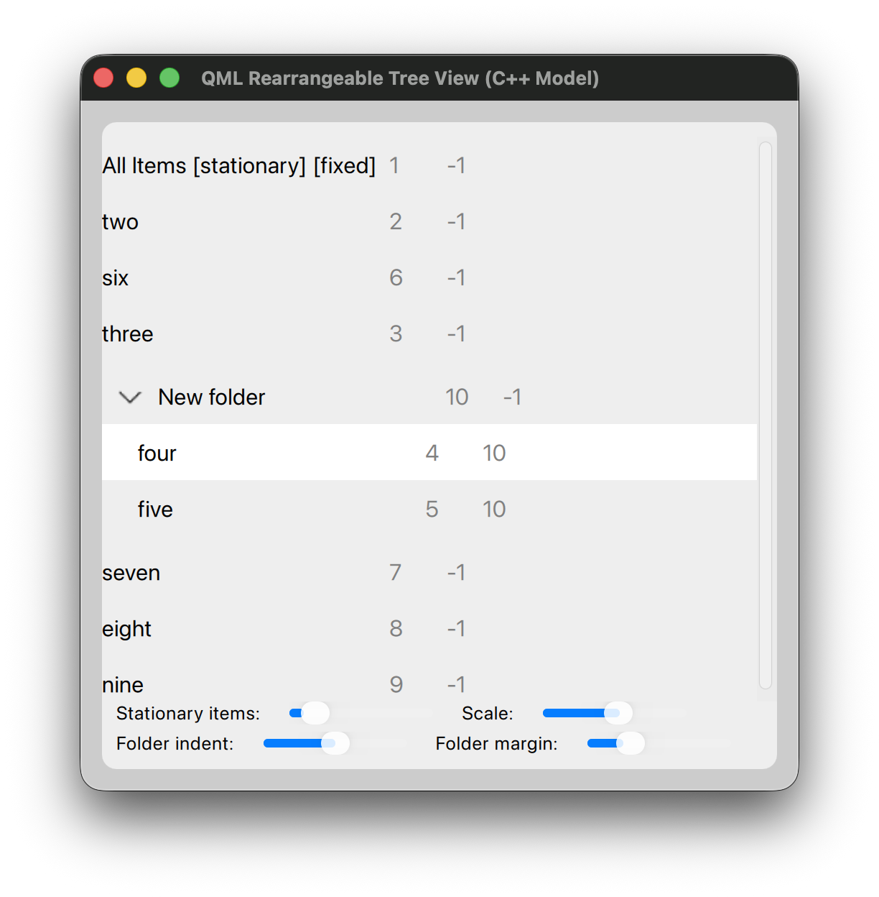

# QMLRearrangeableTreeView

Copyright 2026 Eric Gregory

QMLRearrangeableTreeView is a list-based TreeView for Qt 6 that can be rearranged with a mouse or touch device.  This was originally built for the [Fang RSS reader.](https://github.com/MrEricSir/Fang)  Someday maybe there will be a built-in QML component that does this, but alas, that day is not today.  In the meantime I'm giving this code away for free (see the included LICENSE file for details.)

**Note:** Despite the name of the project, the magic lives in the `RearrangeableDelegate.qml` component rather than the tree view.

On the web at: https://github.com/MrEricSir/QMLRearrangeableTreeView


## Features

* Rearrangeable by either pressing or long-pressing (configurable) on an item and dragging it.
* One item can be "selected" with a mouse click.
* One-level deep folders (similar to Slack channel sections or iOS home screen folders.)
* Arbitrary number of stationary items can't be rearranged at the top of the list.
* Works with a standard QML ListView.
* Data is stored entirely in the list model itself.
* Simple `C++` example demonstrates how to integrate it into your own application. 


## Try It Out

There are two ways to test out the project to see if it meets your needs; with the `qml` 
tool or with the full `C++` example.

The easiest way is with the `qml` command line tool. From within the project directory,
 run this command:

````bash
qml -I . main.qml
````

In a real world scenario you would use QMLRearrangeableTreeView in a C++ project. Use 
`cmake` to build the example project.


## Usage Guide

The easiest way to include this in your own project is to add it as a git submodule and 
include the provided CMakeLists.txt file.

````bash
git submodule add https://github.com/MrEricSir/QMLRearrangeableTreeView.git
````                                   
                                                                                                  
In your CMakeLists.txt:                                                                               

````cmake
add_subdirectory(QMLRearrangeableTreeView)                                                                
target_link_libraries(myapp PRIVATE rearrangeabletreeview)
````

In your QML:

````qml
import RearrangeableTreeView

// Inside your custom ListView delegate:
RearrangeableDelegate {
    // ...
}
````

In your C++ implementation, look at the example `TreeModel` class to see how to create a
`QAbstractListModel` that represents your list data and expose it to the QML layer.


## Pitching In

Much like the GIFs on every 90's website warned you, this code too is under construction.  
If you find a bug feel free to open an issue on GitHub or submit a pull request.

Contributions are welcome.
